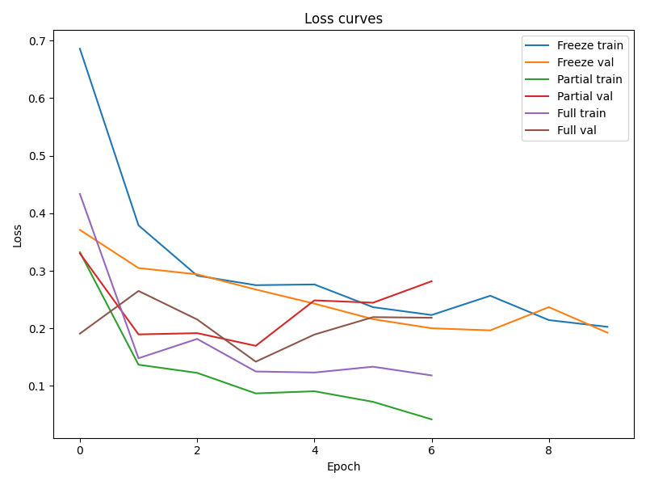
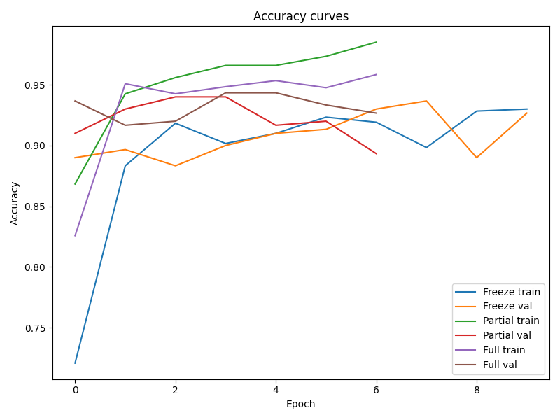

Вот вариант “красивого” README, который можно сразу разместить на GitHub. Он компактный, с бейджами и визуальной структурой:

---

# 🚀 Transfer Learning with MobileNetV2 on CIFAR Dataset

[](https://www.python.org/)
[](https://pytorch.org/)
[](LICENSE)

This repository demonstrates **transfer learning** using **MobileNetV2** for classification on selected classes from **CIFAR-10**. Supports **Freeze**, **Partial**, and **Full** fine-tuning modes.

---

## 📂 Project Structure

```
transfer_curs/
│
├── configs/          # YAML configs for training modes
├── data/             # CIFAR-10 dataset folder
├── src/
│   ├── models/       # Model loading & freezing utilities
│   └── training/     # Training scripts & Trainer class
├── utils/            # Config loader, seed setting, helpers
├── outputs/          # Saved plots & checkpoints
├── test.py           # Test model and trainable parameters
└── main_train.py     # Full training with visualization
```

---

## ⚙️ Installation

```bash
git clone https://github.com/<your-username>/transfer_curs.git
cd transfer_curs
conda create -n finetune python=3.11
conda activate finetune
pip install torch torchvision matplotlib seaborn pyyaml
```

---

## 📝 Configuration

Control training via YAML files in `configs/`:

| Config         | Mode              | Description                  |
| -------------- | ----------------- | ---------------------------- |
| `freeze.yaml`  | Freeze all layers | Only classifier is trainable |
| `partial.yaml` | Partial unfreeze  | Last N layers trainable      |
| `full.yaml`    | Full fine-tune    | Entire model trainable       |

**Example (`freeze.yaml`):**

```yaml
inherits: "base.yaml"
training:
  mode: "freeze"
  lr: 1e-3
```

---

## 🏃 Usage

### 1. Test the model

```bash
python test.py --config configs/freeze.yaml
```

* Prints total & trainable parameters for each mode.
* Verifies forward pass.

### 2. Train the model

```bash
python main_train.py
```

* Trains **Freeze**, **Partial**, **Full** modes.
* Saves **loss** and **accuracy curves** in `outputs/plots/`.

---

## 📊 Results

Example after 10 epochs on 3 classes:

| Mode    | Val Accuracy |
| ------- | ------------ |
| Freeze  | 69%          |
| Partial | 73%          |
| Full    | 87%          |

**Plots:**

* `outputs/plots/loss_curves.png` – training & validation loss
* `outputs/plots/accuracy_curves.png` – training & validation accuracy




---

## 📚 Dataset

Default: **CIFAR-10**

Select classes in config:

```yaml
data:
  type: "cifar10"
  classes: [0, 1, 2]  # Example subset
  batch_size: 32
  image_size: 32
```

> ⚠️ Number of classes must match dataset labels.

---

## 📄 License

MIT License

---
